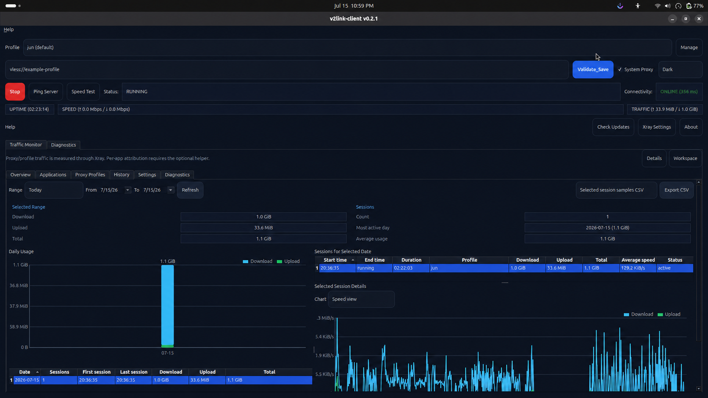
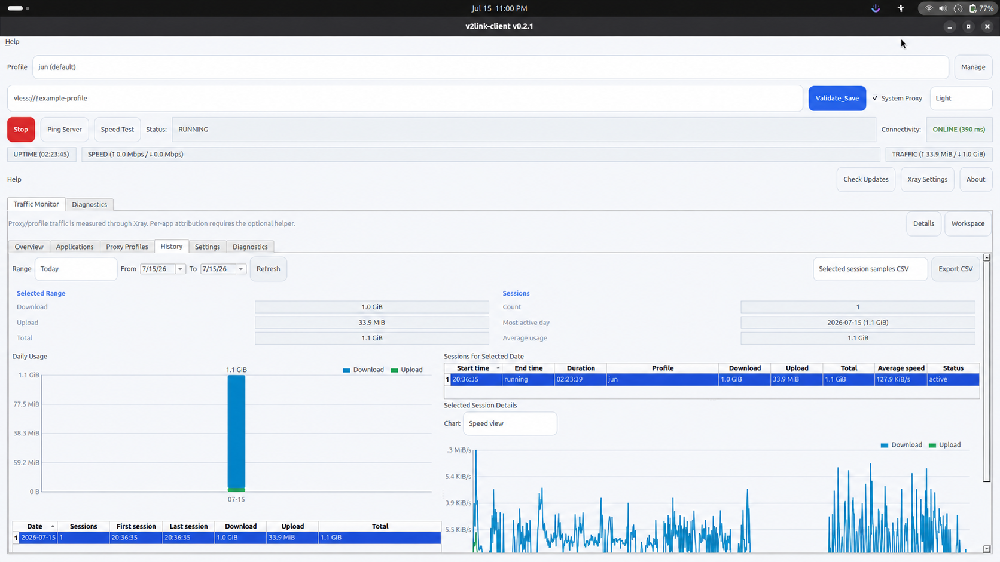

# v2link-client

A focused Linux desktop client for V2Ray-style links, built with Python 3.11+, PyQt6, and Xray-core.

**Current release:** v0.2.3 · **Status:** Beta (stable for daily use with a focused feature scope)

[Download the latest release](https://github.com/UdayaSri0/v2link-client/releases/latest) · [Changelog](CHANGELOG.md) · [Developer guide](docs/development.md)

## Screenshots

<p>
  
</p>

<p>
  
</p>

The v0.2.1 History view shows local daily totals, session summaries, and a bounded, peak-preserving session chart. Screenshot connection details are placeholders.

## What's New in v0.2.1

- A bounded background storage worker keeps recurring SQLite writes off the GUI thread.
- Live statistics, Traffic Monitor tabs, history queries, and diagnostics now refresh independently to keep long sessions responsive.
- Automatic session charts preserve traffic peaks while querying and rendering no more than 900 points.
- Ordered, repeat-safe shutdown saves final traffic state, restores session-owned proxy settings, and reaps only processes started by the GUI.
- Application and Xray logs rotate within documented limits; detailed Xray diagnostic logging is opt-in.
- Privacy-safe diagnostics report runtime performance, database/log sizes, process ownership, proxy state, and netmon readiness without exposing profile secrets.

See the [v0.2.1 release notes](docs/releases/v0.2.1.md) for the complete upgrade and packaging details.

## Key Features

- Validate and run `vless://` profiles through a bundled, custom, or system Xray-core.
- Save multiple profiles with favorites, a default profile, duplication, editing, deletion, and validation that persists across restarts.
- Expose local SOCKS5 and HTTP proxies, automatically selecting free ports when the defaults are unavailable.
- Optionally apply, audit, repair, and safely restore supported desktop system-proxy settings while connected.
- Check connection health, server latency, proxy download speed, uptime, live throughput, and cumulative traffic.
- Explore Overview, Applications, Proxy Profiles, History, Settings, and Diagnostics in the Traffic Monitor.
- Store traffic locally in SQLite with daily/monthly totals, per-profile usage, session drill-down, charts, configurable retention, and CSV exports.
- Keep long-running monitoring responsive with bounded background persistence, cached history sections, and peak-preserving chart downsampling.
- Inspect Xray, proxy, traffic database, process ownership, and optional `v2link-netmon` helper readiness without running the GUI as root.
- Check GitHub Releases for updates and switch between light and dark themes.

## Runtime Requirements

- Linux desktop environment (GNOME, KDE, or another desktop that can use the local manual proxy endpoints)
- `x86_64` system for official AppImage and Debian/APT packages
- `aarch64` source support is retained, but official ARM64 artifacts await native CI

Official AppImage, `.deb`, and APT releases include bundled Xray-core for normal operation. Source builds may use bundled vendor files from `./scripts/fetch_xray_core.sh` or a system `xray` from `PATH` as a fallback.

## Supported Install Methods

Primary supported release artifacts:

1. **AppImage**
2. **Debian package (`.deb`)**

Also available for Debian/Ubuntu users:

3. **APT repository** (published from release workflow)

## Install from AppImage

1. Download the AppImage from the [latest GitHub release](https://github.com/UdayaSri0/v2link-client/releases/latest).

Expected artifact name pattern:

- `v2link-client-<version>-linux-<arch>.AppImage`
- the currently published official architecture is `x86_64`

2. Make executable and run:

```bash
chmod +x v2link-client-*.AppImage
./v2link-client-*.AppImage
```

3. Optional launcher setup:

```bash
mkdir -p ~/.local/bin
cp v2link-client-*.AppImage ~/.local/bin/v2link-client.AppImage
chmod +x ~/.local/bin/v2link-client.AppImage
```

Create `~/.local/share/applications/v2link-client.desktop`:

```ini
[Desktop Entry]
Name=v2link-client
Exec=/home/YOUR_USER/.local/bin/v2link-client.AppImage
Icon=v2link-client
Type=Application
Categories=Network;
Terminal=false
```

## Install from `.deb`

1. Download the `.deb` from the [latest GitHub release](https://github.com/UdayaSri0/v2link-client/releases/latest).

Expected artifact name pattern:

- `v2link-client_<version>_<arch>.deb`
- `<arch>` is `amd64` or `arm64`

2. Install:

```bash
sudo dpkg -i v2link-client_<version>_amd64.deb
sudo apt -f install
```

3. Launch:

```bash
v2link-client
```

## Install via APT Repository (Optional)

Import the repository key:

```bash
curl -fsSL https://udayasri0.github.io/v2link-client/apt/public.key \
  | gpg --dearmor \
  | sudo tee /usr/share/keyrings/v2link-client-archive-keyring.gpg >/dev/null
```

Add the source list:

```bash
echo "deb [arch=amd64,arm64 signed-by=/usr/share/keyrings/v2link-client-archive-keyring.gpg] https://udayasri0.github.io/v2link-client/apt stable main" \
  | sudo tee /etc/apt/sources.list.d/v2link-client.list >/dev/null
```

Install:

```bash
sudo apt update
sudo apt install v2link-client
```

## Run from Source

```bash
python3 -m venv .venv
source .venv/bin/activate
python -m pip install --upgrade pip
pip install -r requirements.txt
./scripts/dev_run.sh
```

For editable installs, architecture notes, important runtime invariants, tests,
packaging, isolated XDG environments, and contribution guidance, see the
[Developer guide](docs/development.md).

## Local Build Instructions

Build AppImage only:

```bash
./scripts/build_appimage.sh
```

Build `.deb` only:

```bash
./scripts/build_deb.sh
```

Build full release set (PyInstaller + AppImage + `.deb` + checksums):

```bash
./scripts/build_release.sh
```

The release build fetches a pinned official Xray-core release into `vendor/xray/<arch>/` and bundles it into the AppImage and `.deb`. Maintainers can refresh the vendor copy directly:

```bash
./scripts/fetch_xray_core.sh
```

Developers can normally use `./scripts/dev_run.sh`; it fetches and verifies the pinned
official release once when the native vendor copy is missing. Disable that network
bootstrap with `V2LINK_SKIP_XRAY_FETCH=1 ./scripts/dev_run.sh`.

GitHub's automatically generated **Source code** ZIP and tar.gz files are not prebuilt
Linux applications. Ordinary users should download the named AppImage or `.deb`, both
of which contain Xray-core and its geo assets.

Artifacts are written to `dist/`:

- `v2link-client-<version>-linux-<arch>.AppImage`
- `v2link-client_<version>_<arch>.deb`
- `SHA256SUMS`

## Release Process (Maintainers)

The manually triggered GitHub Actions release workflow validates the version and
curated notes, tests the project, fetches checksum-pinned Xray-core, builds and
verifies the AppImage and Debian package, and supports a non-publishing dry run.

See the [maintainer release process](docs/maintainer-release.md) for preparation,
dry-run, publication, APT signing, and safe recovery instructions.

## APT Signing Key Setup (Maintainers)

Public key file is committed at `apt/public.key`.

Export matching private key:

```bash
gpg --armor --export-secret-keys "v2link-client APT Repository <apt@v2link-client.local>"
```

GitHub secrets:

- `APT_GPG_PRIVATE_KEY`: ASCII-armored private key
- `APT_GPG_PASSPHRASE`: key passphrase (if protected)

## Usage

1. Paste `vless://` link.
2. Click **Validate & Save**.
3. Click **Start**.
4. Enable **System Proxy** for desktop-wide proxying, or use **Copy manual proxy settings**.

The app resolves Xray-core in this order: custom path from **Xray Settings**, bundled Xray, then system `xray` from `PATH`. Diagnostics and About show the active Xray source, path, and version.

## Traffic Monitor

The Traffic Monitor records local traffic history and shows:

- Dashboard tabs for **Overview**, **Applications**, **Proxy Profiles**, **History**, **Settings**, and **Diagnostics**
- Today upload/download totals
- Current session upload/download and live speed
- This month upload/download totals
- Per saved-profile upload/download totals
- Daily usage aggregation and a lightweight in-app daily usage chart
- Daily history with Today, Last 7 days, Last 30 days, This month, and custom date ranges
- Session history for each selected date, including start/end time, duration, profile, download, upload, total, average speed, and status
- Session drill-down charts for speed or cumulative usage over time
- Advanced **Applications** tab with optional helper-readiness and attribution diagnostics
- Settings for detailed sample retention, CSV export, and clearing local traffic history
- Diagnostics for the stats API, helper readiness, and local traffic database

## Proxy/Profile Tracking

Proxy/profile tracking records traffic from Xray's Stats API while the core is running. It works in the normal GUI with no root permission because Xray provides proxy counters through its local API. The app does not use `xray api -reset`, so live labels and history do not fight over counters.

Live counters are polled every 2 seconds, while cumulative history is persisted every 5 seconds through one bounded SQLite writer. Overview work runs at most every 10 seconds and only for its visible tab. History and diagnostics do not query on live ticks. Automatic session charts load and render at most 900 peak-preserving points; detailed samples default to 30-day retention.

The original progressive stutter came from coupling each live callback to synchronous SQLite writes, full dashboard/history refreshes, and increasingly large chart reads. Those paths are now separated and bounded. See [Traffic Monitor internals](docs/traffic-monitor.md) and [runtime performance troubleshooting](docs/runtime-performance-troubleshooting.md).

Bundled Xray-core is enough for proxy/profile tracking in official AppImage, `.deb`, and APT installs. Per-application tracking is separate and still needs the optional helper service described below.

Daily totals are aggregated by sample date and are useful for range summaries. Session totals are grouped by each Start/Stop run, so a connection from 20:00 to 20:30 appears as one session under that date. CSV export supports daily summaries, session summaries, and selected-session samples.

Traffic history is stored locally only in SQLite:

```text
$XDG_DATA_HOME/v2link-client/traffic.sqlite3
```

If `XDG_DATA_HOME` is not set, the app uses the platform default data directory through `platformdirs`, usually `~/.local/share/v2link-client/traffic.sqlite3` on Linux.

Settings are stored at:

```text
$XDG_CONFIG_HOME/v2link-client/traffic_settings.json
```

## Per-Application Tracking

Per-application tracking is advanced and optional. It is separate from normal proxy/profile traffic tracking, which works through Xray's Stats API without root permission. True Linux app attribution needs the optional privileged helper service `v2link-netmon`, because process/executable attribution must happen outside the unprivileged GUI. The GUI never runs as root.

Debian packages install the optional helper and systemd service, but do not enable it automatically:

```bash
sudo systemctl enable --now v2link-netmon
sudo systemctl disable --now v2link-netmon
```

The helper exposes read-only JSON stats over `/run/v2link-client/netmon.sock`. In v0.2.1 this integration remains a prepared, optional path rather than guaranteed full attribution. If the helper, permissions, or eBPF backend are unavailable, the GUI stays unprivileged and shows a clear unavailable/diagnostic state.

## Privacy

Traffic history never leaves your machine. Proxy/profile stats come from Xray counters. When optional application attribution is available, it records only local process names, executable paths, UIDs, and byte counters. It does not decrypt traffic, inspect packet payloads, read messages, collect tokens/cookies, or upload telemetry anywhere.

## Limitations

Per-application attribution, when available, is not perfect with a local proxy. When system proxy is enabled, apps may connect to `127.0.0.1` while Xray performs the encrypted remote connection, so some traffic can appear under `Xray Core / Proxy Tunnel`. Xray is shown separately and is not hidden.

## Troubleshooting Traffic Monitor

- If proxy/profile totals stay at zero, confirm Xray is running and the diagnostics tab shows a configured stats API server.
- If the Applications tab says the helper is unavailable, enable the optional service with `sudo systemctl enable --now v2link-netmon`.
- If the helper is running but eBPF is unavailable, check Traffic Monitor diagnostics for kernel/capability details.
- For growing CPU, memory, logs, or suspected leftover processes, run `./scripts/diagnose_runtime_performance.sh` as your normal user. It prints aggregate sizes and process metadata, never profile URLs, credentials, traffic rows, or process arguments. Exit code `1` means it found a possible stale Xray/stats process to inspect; it never kills anything.
- Closing V2Link stops only the GUI-owned Xray process group and temporary `xray api statsquery` child. The independent system `v2link-netmon.service` may remain running by design.
- Python logs rotate at 2 MiB with five backups. `xray_stdout.log` is bounded to 2 MiB with two backups. Xray access logging is disabled by default; detailed bounded diagnostic logging can be enabled under **Xray Settings**.
- AppImage builds work without the helper and will show the helper-unavailable state.

## Supported Link Scope

Currently implemented:

- `vless://`
- `security=tls` and `security=none`
- transport: `tcp`, `ws`, `grpc`
- optional: `sni`, `fp`, `alpn`, `allowInsecure`, `flow`
- limited `headerType=http` handling for TCP

Not yet implemented:

- `vmess://`, `trojan://`, `ss://`
- REALITY and advanced routing profiles

## Data and Logs

- Saved profiles: `$XDG_CONFIG_HOME/v2link-client/profiles.json` (fallback `~/.config/v2link-client/profiles.json`)
- Preferences/legacy compatibility: `~/.config/v2link-client/profile.json`
- Optional custom Xray path: `$XDG_CONFIG_HOME/v2link-client/xray_settings.json`
- Traffic settings: `$XDG_CONFIG_HOME/v2link-client/traffic_settings.json`
- Traffic database: `$XDG_DATA_HOME/v2link-client/traffic.sqlite3`
- Runtime state and logs: `$XDG_STATE_HOME/v2link-client/` (logs are in `logs/`)

Unset XDG variables use the normal Linux defaults under `~/.config`, `~/.local/share`, and `~/.local/state`. To stop detailed sample growth, turn off proxy/profile history in **Traffic Monitor → Settings**; aggregate display still remains available for the live session.

## Troubleshooting

### Connectivity OFFLINE / TLS EOF errors

Common causes:

- Invalid endpoint or blocked server
- Mismatched `sni` and certificate with strict TLS verification (`allowInsecure=0`)

Actions:

- verify link/server settings
- try `sni` aligned with target host
- inspect logs via **Open logs folder**

### Qt xcb plugin error (`libxcb-cursor.so.0`)

Install missing runtime library:

```bash
sudo apt update
sudo apt install -y libxcb-cursor0
```
